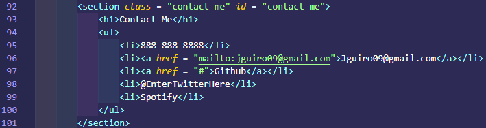
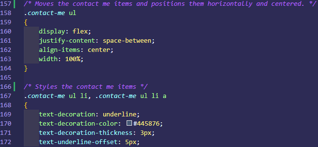

# Portfolio


## Table Of Contents
   [Deployed Website](#Deployed-Website)  
   [Primary Goal](#Primary-Goal)  
   [Why Is A Responsive Website Important?](#Why-A-Responsive-Website-Is-Important)  
   [Utilization of Flexbox](#Utilization-of-Flexbox)  
   [Creation of Website](#Creation-of-Website)  
   [Final Responsiveness](#Final-Responsiveness)  
   [Acceptance Criteria](#Acceptance-Criteria)  
   [Special Thanks](#Special-Thanks)  
   [License](#License)  

## Deployed Website
[**Click here for portfolio**](https://jguiro09.github.io/Portfolio/)

## Primary Goal
The goal of this project was to be able to make a portfolio website that we would be able to put our projects in. The catch was that the portfolio had to be a responsive website.

## Why A Responsive Website Is Important
A responsive website will adjust its content to be able to fit on all forms of devices. Normally, this would not be a huge deal if everyone looked at websites on their computers, but thats not what the statistics say.

[**According to perficient, "68.1% of all website visits in 2020 came from mobile devices"**](https://www.perficient.com/insights/research-hub/mobile-vs-desktop-usage)

With this in mind, a website should be able to adapt to both a computer monitor's resolution, AND a mobile device's resolution.

## Utilization of Flexbox
One way to make a website responsive is using "flexbox". Flex box allows you to store items inside of a container and allow us to manipulate these items to adjust to the width and height of the display resolution.

[**More Information on Flexbox Here**](https://css-tricks.com/snippets/css/a-guide-to-flexbox/#background)


## Creation of Website


### NOTES
**The "responsive" changes are not shown completely here. If you would like to see that portion, please access my style.css and scroll to line 183.**

**RED BORDER = A DIV**

**BLUE BORDER = A SECTION**

### Understanding Units Used
The following units were used inside my coding with (sourced from [W3 Schools](https://www.w3schools.com/cssref/css_units.asp)):
```
    1. VH =  Relative to 1% of the height of the viewport
    2. VW = Relative to 1% of the width of the viewport
    3. % = Relative to parent element
```

### **Header**
#### Wireframe


#### HTML Applied


#### CSS Applied


### **Hero Image**
#### Wireframe


#### HTML Applied


#### CSS Applied


### **"About Me" Section**
#### Wireframe


#### HTML Applied


#### CSS Applied


### **"Work" Section**
#### Wireframe


#### HTML


#### CSS


### **"Contact Me" Section**
#### Wireframe


#### HTML


#### CSS Applied


## Final Responsiveness
Below, you will see how flexbox can changed my website based on the display resolution provided.

### **1068px**  


### **867px**  


### **500px**  


## Acceptance Criteria
**Provided by UT Austin Coding Bootcamp**
```
    1. Provided developer's name, a recent photo, and links to sections about them, their work, and how to contact them.
    2. Clicking the nav links scrolls to proper section.
    3. Titled images of developers applcation.
    4. First applcation is bigger than the others.
    5. When clicked, the applcation takes you to the deployed website/project.
    6. When resized, the website adapts to the new viewport. 
```
## Special Thanks
**Click Name For Github:**  
[Brandon Norsworthy](https://github.com/brandonnorsworthy): Helped with the usage of flexbox and responsive design.  
[Christyn Garcia](https://github.com/christyns92): Helped bounce ideas and implement my images and "about me" section.  
[Jessamyn McTwigan](https://github.com/jessamyn27): Helped with CSS adjustments and margin aligning.
## License
Copyright (c) 2013 Mark Otto.

Copyright (c) 2017 Andrew Fong.

Permission is hereby granted, free of charge, to any person obtaining a copy of this software and associated documentation files (the "Software"), to deal in the Software without restriction, including without limitation the rights to use, copy, modify, merge, publish, distribute, sublicense, and/or sell copies of the Software, and to permit persons to whom the Software is furnished to do so, subject to the following conditions:

The above copyright notice and this permission notice shall be included in all copies or substantial portions of the Software.

THE SOFTWARE IS PROVIDED "AS IS", WITHOUT WARRANTY OF ANY KIND, EXPRESS OR IMPLIED, INCLUDING BUT NOT LIMITED TO THE WARRANTIES OF MERCHANTABILITY, FITNESS FOR A PARTICULAR PURPOSE AND NONINFRINGEMENT. IN NO EVENT SHALL THE AUTHORS OR COPYRIGHT HOLDERS BE LIABLE FOR ANY CLAIM, DAMAGES OR OTHER LIABILITY, WHETHER IN AN ACTION OF CONTRACT, TORT OR OTHERWISE, ARISING FROM, OUT OF OR IN CONNECTION WITH THE SOFTWARE OR THE USE OR OTHER DEALINGS IN THE SOFTWARE.
